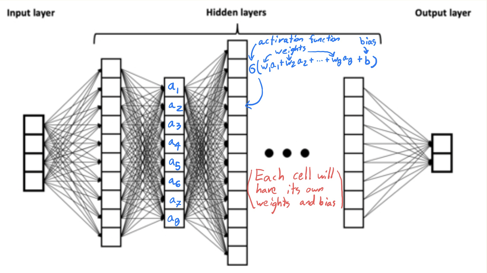

# Neural networks

## References

* Recommended series of videos by [3Blue1Brown](https://www.3blue1brown.com/topics/neural-networks).

* I first learned about neural networks in this online book [Neural Networks and Deep Learning](http://neuralnetworksanddeeplearning.com/) by Michael Nielsen.

* Chapter 10 of [Hands-on Machine Learning](https://learning.oreilly.com/library/view/hands-on-machine-learning/9781492032632/ch10.html).

## Introduction

A **neural network** is a special type of function.  Here is a picture of a so-called *deep* neural network.

Image source: <a href="https://commons.wikimedia.org/wiki/File:Example_of_a_deep_neural_network.png">BrunelloN</a>, <a href="https://creativecommons.org/licenses/by-sa/4.0">CC BY-SA 4.0</a>, via Wikimedia Commons

The left side of the picture represents the input.  The four boxes means there are four input variables (also called input neurons or predictors or features).  

The right side of the picture represents the output, so in this case there are two outputs.  Often there may be just one output.  In the case of handwritten digits, there will be ten output neurons, one for each possible digit.

As the function is evaluated, values move from left to right.  The middle portion of the image is known as the *hidden layers* of the neural network.  When someone refers to a *deep* neural network, they are referring to the number of hidden layers; the more hidden layers, the deeper the network.

To create a neural network using PyTorch, we will often use layers like  `nn.Linear(784,16)`.  The `Linear` in this case refers to the fact that this part of the function can be defined by $X \mapsto WX+\vec{B}$, where $W$ is a matrix of *weights* and where $\vec{B}$ is a *bias* vector.

In Math 10 we will only discuss the most basic type of neural network (which is already very complicated!).  Maybe the second most famous structure is a *Convolutional Neural Network*.

## The formula at a single neuron

In the picture above, you should imagine a number in every box.  The numbers in one layer determine the numbers in the next layer. The numbers on the left-most layer represent the input.  Every other number is determined by a formula of the form 

$$\sigma(\vec{a} \cdot \vec{w} + b)$$ 

Here the vector $\vec{a}$ refers to all the values at the previous layer; the vector $\vec{w}$ refers to the weights between the layers; and the number $b$ is called a *bias*.  The function $\sigma$ is what is called an *activation function*.  One common choice activation function, especially at the output layer, is the logistic function $\sigma(x) = 1/(1 + e^{-x})$; this is the same function we used in logistic regression.  An even more common choice is the **ReLU** function $\sigma(x) = \max(0,x)$.

## The *learning* in machine learning

There are many different options in the design of a neural network.  Before we construct it in PyTorch, we will typically make many choices: how many layers, how many neurons in each (hidden) layer, what activation functions to use (possibly a different activation function in each layer), what value of learning rate to choose, and so on.  What we do not decide is the values of the weights and biases.  The goal of the training algorithm is to find the best weights and biases.

At least for me, the "learning" in machine learning is less obvious in linear regression and K-Nearest Neighbors, but it is very clear with neural networks.  We will usually start with randomly chosen weights, and then gradually update the weights a little at a time.  This procedure of updating the weights is what is meant by learning.

